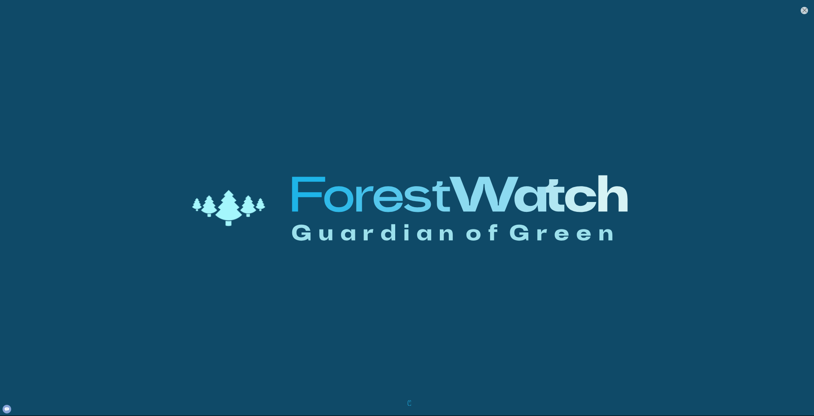

# ForestGuardian: A Comprehensive Tool for Deforestation and Wildfire Detection

ForestGuardian is a state-of-the-art application designed to address the critical sustainability challenges posed by deforestation and wildfires. By leveraging advanced machine learning models, this tool provides robust detection capabilities using satellite imagery, alongside detailed exploratory data analysis (EDA) to help understand and combat these environmental threats.

## Features

1. **Wildfire Detection:**
   - Upload satellite images to detect the presence of wildfires.
   - Displays the original image and prediction results with probabilities.
   - Sidebar information on the dataset and model architecture used for training.

3. **Deforestation Detection:**
   - Upload satellite images to detect deforestation.
   - Displays the original image and prediction results with probabilities for deforestation and pollution.
   - Sidebar information on the dataset and model architecture used for training.

4. **Deforestation Analysis:**
   - Detailed EDA on deforestation data from 2000 to 2020.
   - Comparative analysis of forest coverage in 2000 and 2020 for the top 20 countries.
   - Performance evaluation of various regression models in predicting deforestation trends.

## Installation

To run the ForestGuardian application, ensure you have the following prerequisites installed:

- Python 3.7 or higher
- TensorFlow
- Keras
- Streamlit
- Pandas
- NumPy
- Matplotlib
- Seaborn
- scikit-learn
- XGBoost
- LightGBM
- CatBoost

Clone the repository and navigate to the project directory:

```bash
git clone https://github.com/arpitsinghgautam/ForestWatch.git
cd ForestGuardian
```

Install the required Python packages:

```bash
pip install -r requirements.txt
```

## Usage
To start the Streamlit application, run the following command:
```bash
streamlit run app.py
```

## Model Details

1. **Wildfire Detection:**
   - Architecture: Convolutional Neural Network (CNN)
   - Dataset: Trained on a dataset of 42,000+ satellite images labeled with wildfire occurrences.

3. **Deforestation Detection:**
   - Architecture: Based on ResNet50
   - Dataset: Trained on a dataset of over 40,000 images labeled with deforested areas.


Thank you for using ForestGuardian. Together, let's make a difference in preserving our planet's forests!